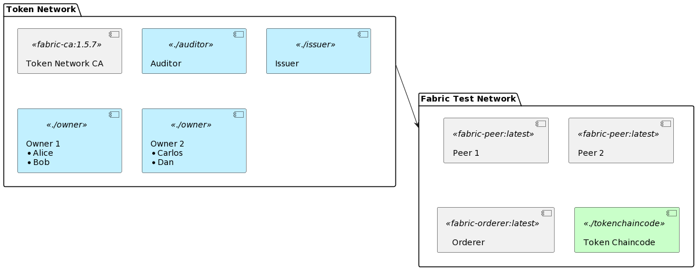
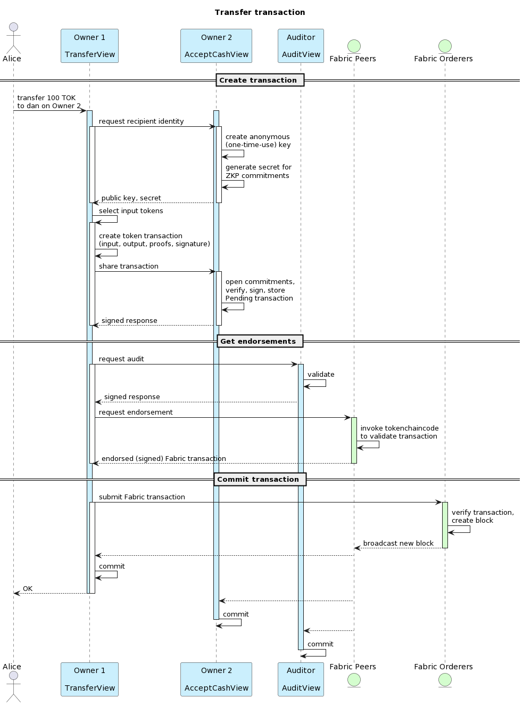
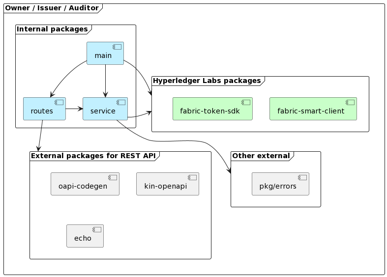

# Token SDK Sample API

This is a service with a REST API that wraps the [Token SDK](https://github.com/hyperledger-labs/fabric-token-sdk) to issue, transfer and redeem tokens backed by a Hyperledger Fabric network for validation and settlement.

Several instances of this service form a Layer 2 network that can transact amongst each other, with an (optional but currently configured to be required) auditor role who has to approve every transaction. The ledger data does not reveal balances, transaction amounts and identities of transaction parties. UTXO Tokens are owned by pseudonymous keys and other details are obscured with Zero Knowledge Proofs.

This sample is intended to get familiar with the features of the Token SDK and as a starting point for a proof of concept. The sample contains a basic development setup with:

- An issuer service
- An auditor service
- Two owner services, with wallets for Alice and Bob (on Owner 1), and Carlos and Dan (on Owner 2)
- A Certificate Authority
- Configuration to use a Fabric test network.

From now on we'll call the services for the issuer, auditor and owners 'nodes' (not to be confused with Hyperledger Fabric peer nodes). Each of them runs as a separate application containing a REST API, the Fabric Smart Client and the Token SDK. The nodes talk to each other via a protocol called libp2p to create token transactions, and each of them also has a Hyperledger Fabric user to be able to submit the transaction to the settlement layer. The settlement layer is just any Fabric network that runs the Token Chaincode, which is configured with the identities of the issuer, auditor and CA to be able to validate transactions.



[plantuml source](https://www.plantuml.com/plantuml/uml/ZPB1IiD048RlUOgXteHM4nIXbD0O4RnO3mKllKmtssR9PYRiRYWYlhlPNPMsIkrjcFs_d-LZvjQXSNsh4ziewj1W2wsYKgErhwfoDQGtrqdIeMXmAs6qv4OIF4ktOzEC02quRk0z0H3STaoI78nMT123iWX9WJ2RmGRNHecnm6awkPtSGPuVmqLVASScCDXN7ffSOLmESRWekauhWKun7RDFrlOoeihQY2g_-vTSx6W8fIkwX6B8I3_SypfKSHgRU4Vd5cMUBz5ejdvwG8fDsQccZptJZy4JBALr1xvhlVdj-qNwluVtRXXJs3Fj5rEDpXVb-PzazaDcPuCBKqdpfPhZlCV6pGayNaXPeoB1bOod94Iqu_oZ-7uBcfPIrCIQjs_UaZ-wyJZtCfAvfAflzIS0)

# Table of Contents

- [Token SDK Sample API](#token-sdk-sample-api)
- [Table of Contents](#table-of-contents)
  - [Features](#features)
  - [Getting started](#getting-started)
    - [Install dependencies](#install-dependencies)
    - [Quick start](#quick-start)
      - [Using the application](#using-the-application)
      - [Deep dive: what happens when doing a transfer?](#deep-dive-what-happens-when-doing-a-transfer)
    - [Alternative: manual start](#alternative-manual-start)
      - [Generate crypto material](#generate-crypto-material)
      - [Start Fabric and install the chaincode](#start-fabric-and-install-the-chaincode)
      - [Start the Token network](#start-the-token-network)
    - [View the blockchain explorer](#view-the-blockchain-explorer)
  - [Development](#development)
    - [End to end tests](#end-to-end-tests)
    - [Code structure](#code-structure)
    - [Add or change a REST API endpoint](#add-or-change-a-rest-api-endpoint)
    - [Upgrade the Token SDK and Fabric Smart Client versions](#upgrade-the-token-sdk-and-fabric-smart-client-versions)
    - [Use another Fabric network](#use-another-fabric-network)
    - [Add a user / account](#add-a-user--account)
    - [Run the service directly (instead of with docker-compose)](#run-the-service-directly-instead-of-with-docker-compose)

## Features

Main flows:

- [x] issue token
- [x] transfer
- [x] redeem / burn
- [x] owner get balances
- [x] owner transaction history
- [ ] auditor get balances
- [x] auditor transaction history
- [ ] issuer transaction history
- [ ] swap

Additional features:

- [x] Documented REST API
- [x] Basic end to end tests
- [x] Support for multiple token types
- [x] Multiple accounts per node
- [x] Use Idemix (privacy preserving) accounts created by a Fabric CA
- [x] Pre-configured and easy to start for development

Out of scope for now:

- HTLC locks (hashed timelock contracts)
- Register/enroll new token accounts on a running network
- Business flows for redemption or issuance
- Advanced transaction history (queries, rolling balance, pagination, etc)
- Denylist / revocation and other business logic for auditor
- Idemix users to submit the transactions to Fabric anonymously
- Production configuration (e.g. deployment, networking, security, resilience, key management)

## Getting started

Prerequisites:

- bash
- golang 1.20+
- git
- docker
- docker-compose

### Install dependencies

Download the Fabric docker images and binaries. The code only works with Fabric CA 1.5.7+, so even if you cloned the fabric-samples repo before, you may have to re-run it to get the latest versions.

From the fabric-samples directory:

```bash
curl -sSLO https://raw.githubusercontent.com/hyperledger/fabric/main/scripts/install-fabric.sh && chmod +x install-fabric.sh
./install-fabric.sh docker binary
```

Make sure that the new binaries are in your path. Change the following line (replace `<your/path/to/>` with the actual path) and add it to your `~/.bashrc` or `~/.zshrc` file. Restart your terminal or `source` the edited file.

```bash
export PATH=</your/path/to/>fabric-samples/bin:$PATH
```

Validate that the CA is at 1.5.7 by executing `fabric-ca-client version`.

> Note: you can run this code from anywhere. If you are _not_ running it from the fabric-samples/token-sdk folder, also set the following environment variable:
>
> ```bash
> export TEST_NETWORK_HOME=</your/path/to>/fabric-samples/test-network
> ```
>
> See the bottom of this readme for instructions to use another Fabric network than the test network.

Install tokengen. Tokengen is a tool to create the configuration file for the token chaincode (once, when deploying the chaincode). It generates the public parameters that the network participants will use to generate their proofs, and it specifies the public identities of the issuer, auditor and CA for signature validation.

```bash
go install github.com/hyperledger-labs/fabric-token-sdk/cmd/tokengen@v0.3.0
```

### Quick start

The quickest way to get going is to run:

```bash
./scripts/up.sh
```

This generates the crypto material, starts Fabric, deploys the chaincode, and starts the token nodes.

When you're done and want to delete everything:

```bash
./scripts/down.sh
```

#### Using the application

The services are accessible on the following ports:

| port | service                  |
| ---- | ------------------------ |
| 8080 | API documentation (web)  |
| 9000 | auditor                  |
| 9100 | issuer                   |
| 9200 | owner 1 (alice and bob)  |
| 9300 | owner 2 (carlos and dan) |

Besides that, the nodes communicate with each other via 9001, 9101, 9201 and 9301 respectively.

Now let's issue and transfer some tokens! View the API documentation and try some actions at [http://localhost:8080](http://localhost:8080). Or, directly from the commandline:

```bash
curl -X POST http://localhost:9100/api/v1/issuer/issue -H 'Content-Type: application/json' -d '{
    "amount": {"code": "TOK","value": 1000},
    "counterparty": {"node": "owner1","account": "alice"},
    "message": "hello world!"
}'

curl -X GET http://localhost:9200/api/v1/owner/accounts
curl -X GET http://localhost:9300/api/v1/owner/accounts

curl -X POST http://localhost:9200/api/v1/owner/accounts/alice/transfer -H 'Content-Type: application/json' -d '{
    "amount": {"code": "TOK","value": 100},
    "counterparty": {"node": "owner2","account": "dan"},
    "message": "hello dan!"
}'

curl -X GET http://localhost:9300/api/v1/owner/accounts/dan/transactions
curl -X GET http://localhost:9200/api/v1/owner/accounts/alice/transactions
```

Notice that the transaction overview uses the UTXO model (like bitcoin). The issuer created a new TOK token of 1000 and assigned its ownership to alice. When alice transfered 100 TOK to dan, she used the token of 1000 as **input** for her transaction. As **output**, she creates two new tokens:

1. one for 100 TOK with dan as the owner
2. one with _herself_ as the owner for the remaining 900 TOK.

This way, each transaction can have multiple inputs and multiple outputs. Their sum should always be the same, and every new transfer must be based on previously created outputs.

#### Deep dive: what happens when doing a transfer?

It may look simple from the outside, but there's a lot going on to securely and privately transfer tokens. Let's take the example of alice (on the Owner 1 node) transfering 100 TOK to dan (on the Owner 2 node).

1. **Create Transaction**: Alice requests an anonymous key from dan that will own the tokens. She then creates the transaction, with commitments that can be verified by anyone, but _only_ be opened (read) by dan and the auditor. The commitments contain the value, sender and recipient of each of the in- and output tokens.
2. **Get Endorsements**: Alice (or more precisely the TransferView in the Owner 1 node) now submits the transaction to the auditor, who validates and stores it. The auditor _may_ enforce any specific business logic that is needed for this token in this ecosystem (for instance a transaction or holding limit).

   Alice then submits the transaction (which is now also signed by the auditor) to the Token Chaincode which is running on the Fabric peers. The chaincode verifies that all the proofs are valid and all the necessary signatures are there. Note that the peer and token chaincode cannot see what is transferred between who thanks to the zero knowledge proofs.

3. **Commit Transaction**: Alice submits the endorsed Fabric transaction to the ordering service. Alice (Owner 1), dan (Owner 2) and the Auditor nodes have been listening for Fabric events involving this transaction. When receiving the 'commit' event, they change the status of the stored transaction to 'Confirmed'. The transaction is now final; dan owns the 100 TOK.

The names of the Views below correspond to the code in `owner/service/transfer.go`, `owner/service/accept.go` and `auditor/service/audit.go`.



[plantuml source](http://www.plantuml.com/plantuml/uml/TLD1JoCz3BtdLrZb0X98yEaxhTGLRA5xu50EQ0-hNZA92r6dpcpY3Eg_tsHcYDmoUvb9hFUUxHVxFh8Ed0wjOiSjmclG57SOWCj16tQUbCf_7s3nq3g32z0HjEeopHdNQM9OR3ueK-wsjALFWLyEFmOezt2n-l6qNZ_ESVuhd0TZiEELZk-LrRXvraEoZdqOMELO2JhPob18xFW8YxLkWZFmWXZYWEhA2IuU_ry_hfxEOPjWCNmYVRb8i5ekOHLGCqflOBbK6cw-bpQ_0N-wTtTx2w-Rvosn1wi9Cd3gLnLUhnc5CJKcs-Q-o3OkomRyap1o_cSR71A3isFjIiefgQCQL_bcB5kJf-F1fxYbIqzum-w0DodY5UpnAF5lI1WA8sAcCkoAuR-VNy3umy7n0OcZ2iWf47IfQPqf2jSJN5ayAOhxwa_45Ws3eouniDyZHTb0XTQQHv0qFDS-qA_19nx-NV1-5tDszqQQKy0hwLryrm6bmBzCyXsIRF1wIpq6jpkEoldBFk2MNf2iepSfENanuD12mDXvYWZdJkG9-eaCMS27Y4EMF3zJjJfPyTJvvbXwKyydarxEbTlhrjcC6AFLyzEYncpZ8jHyiYQHzNHRnflWEkhzVdeYywuT6M-nZ7ojPCwaAPE5ox6oAnZNJs9dZ5iDBoD1rRgwgwNRr6JOdEISbr-tl0PEPST9a7fvFAOHRLflze8e76g2rzReo43uCG4jVicUhPsOvqimD3r4SaZdoERvr9kpcr2IqrsL1Bfn4gsJbSCqHoWGTOzaqw7z2m00)

### Alternative: manual start

To get a better view or have more control on the different layers of the network, you can also start the services manually. If you want to do that, first bring down everything with `./scripts/down.sh`.

#### Generate crypto material

In this step, we create all the identities which are used by the Token network. We use a normal Fabric CA for this. Technically, only the Owner identities (the wallets that will hold the tokens) need some form of hierarchy; they use Idemix credentials which must be issued by a single, known issuer (see [Fabric documentation](https://hyperledger-fabric.readthedocs.io/en/latest/idemix.html) for more info about idemix). To keep things simple, we use the same CA for the other identities too. The Token SDK expects the folders for the identities to be in Fabric's 'msp' structure.

The following crypto will be generated:

- Fabric Smart Client node identities, used by the nodes to authenticate each other
- Token Issuer identity (x509 certificate and private key)
- Token Auditor identity (x509 certificate and private key)
- Owner identities (idemix credentials)

```bash
mkdir -p keys/ca
docker-compose -f compose-ca.yaml up -d
./scripts/enroll-users.sh
```

> If you want, you can stop the CA now. You don't need it unless you want to register more users.
>
> ```bash
> docker-compose -f compose-ca.yaml down
> ```

The Issuer and Auditor identities are used by the Token Chaincode to validate token transactions. It also needs the identity of the CA that issues the Idemix credentials to the Owner wallets. The tokengen command generates the configuration that contains these identities and the cryptographic parameters for the proofs. We store it in the `tokenchaincode` folder, so that it will be baked into the chaincode docker image later.

```bash
tokengen gen dlog --base 300 --exponent 5 --issuers keys/issuer/iss/msp --idemix keys/owner1/wallet/alice --auditors keys/auditor/aud/msp --output tokenchaincode
```

> You only have to do this once. But if for any reason you want to re-generate the material: `rm -rf keys; rm tokenchaincode/zkatdlog_pp.json` and execute the steps above again. If any owner has existing tokens, they will now be invalid because the old proofs can not be verified with the new parameters.

#### Start Fabric and install the chaincode

For simplicity, in this sample all nodes use the credentials of User1 from Users and have Peer1 as a trusted peer. In a more serious setup, each instance would have its own (idemix) Fabric user and _may_ have it's own MSP and peers, depending on the network topology and trust relationships.

Start a Fabric sample network and deploy the Token Chaincode as a service:

```bash
../test-network/network.sh up createChannel
INIT_REQUIRED="--init-required" ../test-network/network.sh deployCCAAS -ccn tokenchaincode -ccp $(pwd)/tokenchaincode -cci "init" -verbose -ccs 1

mkdir -p keys/fabric && cp -r ../test-network/organizations keys/fabric/
```

> To fully remove the whole network:
>
> ```bash
> docker stop peer0org1_tokenchaincode_ccaas peer0org2_tokenchaincode_ccaas
> ../test-network/network.sh" down
> rm -rf keys/fabric
> ```

#### Start the Token network

> On the bottom of this document you'll find instructions to run the nodes as golang binaries natively instead of with docker compose.

```bash
rm -rf data/auditor data/issuer data/owner1 data/owner2
mkdir -p data/auditor data/issuer data/owner1 data/owner2
docker-compose up -d
```

Visit [http://localhost:8080](http://localhost:8080) to view the API documentation and execute some transactions.

### View the blockchain explorer

As a bonus, this sample contains configuration to connect the [blockchain explorer](https://github.com/hyperledger-labs/blockchain-explorer/) with the fabric-samples network. It allows you to inspect the transactions which are committed to the ledger. It shows more of what the Token SDK does under the covers.

Start it as follows:

```bash
cd explorer
docker-compose up -d
```

And visit it in the browser on [localhost:8081](http://localhost:8081).

To tear it down, do this (the -v is important; it removes the volumes that contain the identities and blocks):

```bash
docker-compose down -v
```

## Development

### End to end tests

See the `e2e` folder for some tests that exercise the APIs. The end to end tests require the services to be running. They create new transactions, so don't run them on a deployment you want to keep clean.

```bash
go test ./e2e -count=1 -v
```

### Code structure

This repo contains 3 different, isolated golang applications, one for each of the roles: _issuer_, _auditor_, and _owner_. They are maintained separately and each have their own dependencies. In a production scenario these would have their own lifecycle, and most likely be maintained and deployed by different organizations.

The code structure of each of the roles is the same. There is overlap between the roles; each has the boilerplate code to start the Fabric Smart Client and Token SDK. The main.go is almost identical; the only difference is which 'responders' the application registers. Also the contents of the routes and the services will depend on the features that a role needs:

- Issuers can issue funds
- Auditors see and sign every transaction
- Owners can transfer funds.

Here's an example of the code structure for the auditor:

```
auditor
├── main.go
├── oapi-server.yaml
├── conf
│   └── core.yaml
├── routes
│   ├── operations.go
│   ├── routes.gen.go
│   ├── routes.go
│   └── server.go
└── service
    ├── audit.go
    ├── balance.go
    └── history.go
```

As you can see, the business logic is all in the 'service' directory. The 'routes' are purely the code needed for the REST API. We chose to use _openapi-codegen_ to generate the code for the routes, and _echo_ as the server. The 'routes' package is just the presentation layer; you could easily replace it and call the code from the 'service' package from somewhere else. For instance if you wanted to create a CLI application for the issuer!



[plantuml](http://www.plantuml.com/plantuml/uml/RP71QlCm3CVlVWhHxnpw1X_jeR32e6FhRVIWEafgubX6ThgMqNTVQZjqAOD0PFd7pt_Pgn1Huj1RrGZs18lTboE19Mn365An7ceJMHRmhG36ht1R5qaSMl2eEsmfB00369ymWCyUZJlSM_S2_gszjqPZDEpoll0GAIGYbtymWUHiD2KedFKpSLEGxLLT_Ry3itMsAfZq1NbCy7Br99RgbWHUyHZcav2FqoWD7iNeAlGeiTBMa8ifKXF6I7lI9yUMs-iCZjoHgqBT9NByFv7pxEIZWZHYMJnIxkA91EYIRxj4uocQxzebYR24GvPcINQo-kNPN9xU2neMUDzyx67zjYrUdBoCtbIQQsh97NAhCwvYJsxSAPrn7fwEBPTSJaPrKojozT3R7m00)

For more information about how we interact with the Token SDK, check out an example on the [Token SDK GitHub](https://github.com/hyperledger-labs/fabric-token-sdk/blob/main/samples/fungible/README.md).

### Add or change a REST API endpoint

We generate the API based on `swagger.yaml`. To keep things a bit simple, we have only one definition which includes all of the roles (even though they are separate applications, running on different ports!) Any changes should be made in this file first. Then generate the code with:

```bash
go install github.com/deepmap/oapi-codegen/cmd/oapi-codegen@latest

oapi-codegen -config auditor/oapi-server.yaml swagger.yaml
oapi-codegen -config issuer/oapi-server.yaml swagger.yaml
oapi-codegen -config owner/oapi-server.yaml swagger.yaml
oapi-codegen -config e2e/oapi-client.yaml swagger.yaml
```

### Upgrade the Token SDK and Fabric Smart Client versions

Token SDK and Fabric Smart Client are under active development. To upgrade to the latest versions:

- change the commit hash of fabric-smart-client and fabric-token-sdk in {auditor,issuer,owner}/go.mod (and do `go mod tidy`)
- change the commit hash in tokenchaincode/Dockerfile
- install tokengen with the new commit hash
- update the readme

### Use another Fabric network

Of course you're not tied to the Fabric samples testnetwork. If you want to anchor your Token services to another blockchain, you have to:

1. Deploy the token chaincode with the generated parameters to the Fabric network
2. Configure the token services with the correct channel, peer and orderer addresses and certs, MSP configuration, and a user (see the `core.yaml` files in the `conf` dir).

### Add a user / account

To add another user, simply register and enroll it at the Token CA (see `scripts/enroll-users.sh`), and configure it at one of the owner nodes (see `conf` dir).

### Run the service directly (instead of with docker-compose)

For a faster development cycle, you may choose to run the services outside of docker. It requires some adjustments to your environment to make the paths and routes work.

Add the following to your `/etc/hosts`:

```
127.0.0.1 peer0.org1.example.com
127.0.0.1 peer0.org2.example.com
127.0.0.1 orderer.example.com
127.0.0.1 owner1.example.com
127.0.0.1 owner2.example.com
127.0.0.1 auditor.example.com
127.0.0.1 issuer.example.com
```

> The Token SDK discovers the peer addresses from the channel config (after connecting to a configured trusted peer).

For the paths you have two options:

1. Find/replace all instances of /var/fsc in the conf directory with the path to this repo. **Or**
2. Create a symlink to this folder to make the configuration files work (they don't play nice with relative paths):
   ```bash
   sudo ln -s "${PWD}" /var/fsc
   ```
   The advantage of this approach is that the configuration is portable across developer laptops and works with docker-compose as well as without.

Start the blockchain and deploy the chaincode (see above).

Instead of doing docker-compose up, start the token services with (each in their own terminal):

```bash
mkdir bin
go build -o bin/auditor ./auditor
go build -o bin/issuer ./issuer
go build -o bin/owner ./owner

PORT=9000 CONF_DIR=./auditor/conf ./bin/auditor
PORT=9100 CONF_DIR=./issuer/conf ./bin/issuer
PORT=9200 CONF_DIR=./owner/conf/owner1 ./bin/owner
PORT=9300 CONF_DIR=./owner/conf/owner2 ./bin/owner
```

Now you can use the REST APIs to control the services (see the swagger definition).

When you made changes in the code, stop a service with CTRL+C, `go build -o bin/owner ./owner` and start it again.

If you want to reset the transaction history:

```bash
rm -rf data/auditor data/issuer data/owner1 data/owner2 && mkdir data/auditor data/issuer data/owner1 data/owner2
```
